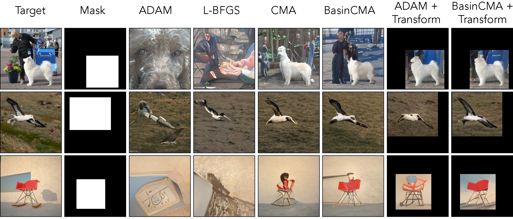

# GAN-Transform-and-Project

### [project page](https://minyoungg.github.io/GAN-Transform-and-Project/) |   [paper]()



<br>


**Transforming and Projecting Images into Class-conditional Generative Networks**  
[Minyoung Huh](http://minyounghuh.com/) &nbsp; [Richard Zhang](https://richzhang.github.io/) &nbsp; [Jun-Yan Zhu](https://people.csail.mit.edu/junyanz/) &nbsp; [Sylvain Paris](http://people.csail.mit.edu/sparis/) &nbsp; [Aaron Hertzmann](https://www.dgp.toronto.edu/~hertzman/)  
MIT CSAIL &nbsp; Adobe Research  

## Prerequisites
The code was developed on
- Ubuntu 18.04
- Python 3.7
- PyTorch 1.2.0

We use the BigGAN PyTorch port from HuggingFaces [github](https://github.com/huggingface/pytorch-pretrained-BigGAN)

## Getting Started
- <b>Install the python dependencies</b>
```bash
pip install -r requirements.txt
```

- <b>Clone [LPIPS](https://github.com/richzhang/PerceptualSimilarity)</b>

  The code uses perceptual similarity loss. We need to clone the LPIPS repo into this directory.
  ```bash
  git clone https://github.com/richzhang/PerceptualSimilarity
  ```
  The path should be in the following format ... or you can set the path manually in `init_paths.py`
  ```bash
  ./GAN-Transform-and-Project/PerceptualSimilarity
  ```

- <b>Download encoder weights</b> (optional)

  The demo code uses encoder weights to speed up optimization.  
  Download the weights from [google drive](https://drive.google.com/drive/folders/1CyDQGBlduBP7lk3WiwazsEViT7VJRnE_?usp=sharing) and place it in the `nets/weights` sub-directory.  

  The encoder weight should be in the following path
  ```bash
  ./GAN-Transform-and-Project/nets/weights/encoder.ckpt
  ```

## Demo
We provide several demos for our project. If you do not wish to use the encoder, disable them appropriately.

- <b>Jupyter demo</b>: A jupyter lab/notebook demo is available in [example.ipynb](example.ipynb)

- <b>Command line</b>: To run our code from command line
  ```bash
  CUDA_VISIBLE_DEVICES=$GPU_ID python demo.py --im=$PATH_TO_IMAGE
  ```
  To see all valid options run `python demo.py --help`

- <b>Streamlit interactive demo</b>:  
  We provide an interactive demo using Streamlit.

  First `pip install streamlit` and then run
  ```
  streamlit run st_interactive.py
  ```
  Navigate to the posted `ip address` using your favorite browser.


## Development
To get a glimpse of how to extend the work or invert images on your generative model. Take a look at [demo.py](demo.py)

- <b> Optimization </b>:
We currently support `GradientOptimizer`, `CMAOptimizer`, `BasinCMAOptimizer`. We also have an experimental optimization methods using [NeverGrad](https://github.com/facebookresearch/nevergrad): `NevergradOptimizer` and `NevergradHybridOptimizer`. You can find the optimizers at [optimizer.py](./optimizer.py).

- <b> Transformation </b>:
We support simple spatial affine transformation and various color transformations. A full list of transformation functions are available at [transform_functions.py](./utils/transform_functions.py). The transformation optimization details are in [transform.py](transform.py).

## Citation

If you found our work useful, please cite using
```
@article{huh2020ganprojection,
    title = {Transforming and Projecting Images to Class-conditional Generative Networks}
    author = {Huh, Minyoung and Zhang, Richard and Zhu, Jun-Yan
              and Paris, Sylvain and Hertzmann, Aaron},
    booktitle={arXiv preprint arXiv},
    year = {2020}
}
```
